# 🚀 Rahul V S | Full Stack Developer & Innovation Engineer

<div align="center">

<!-- Animated Typing Banner with enhanced styling -->


<!-- Enhanced animated banner -->


<!-- Floating tech stack icons -->
<div style="display: flex; justify-content: center; gap: 20px; margin: 20px 0;">
  
  
  
  
</div>

</div>

---

## 🎯 **Mission Control** 

```mermaid
graph TD
    A[🚀 Current Mission] --> B[📱 Attendance App]
    A --> C[🌐 Web3 Exploration]
    A --> D[🎮 AR/VR Development]
    B --> E[React Native + Node.js]
    C --> F[Blockchain + Smart Contracts]
    D --> G[Unity + Flutter AR]
    
    style A fill:#00D9FF,stroke:#333,stroke-width:3px
    style B fill:#FF6B6B,stroke:#333,stroke-width:2px
    style C fill:#4ECDC4,stroke:#333,stroke-width:2px
    style D fill:#45B7D1,stroke:#333,stroke-width:2px
```

<div align="center">



</div>

---

## 🌟 **About The Developer**

<div align="center">


</div>

<div align="left">

### 🎮 **Developer Profile Card**

```json
{
  "name": "Rahul V S",
  "title": "Full Stack Developer & Innovation Engineer",
  "location": "India 🇮🇳",
  "currentFocus": "Building the Future",
  "superpower": "Turning Coffee into Code ☕",
  "currentProject": {
    "name": "Attendance App 📱",
    "stack": ["React Native", "Node.js", "MongoDB"],
    "status": "🚧 In Development"
  },
  "learning": ["Redis", "AR/VR", "Web3", "System Design"],
  "interests": ["Web Dev", "Mobile Apps", "AI/ML", "Gaming"],
  "funFact": "I once debugged a CI pipeline with 200+ lines of YAML and lived to tell the tale 🛠️😄",
  "motto": "Code is like humor. When you have to explain it, it's bad."
}
```

</div>

---

## 🎨 **Frontend Development Zone**

<div align="center">


### 🚀 **Frontend Technologies I Love**

<div style="display: flex; justify-content: center; gap: 15px; flex-wrap: wrap; margin: 20px 0;">
  
  
  
  
  
</div>

</div>

---

## 🔥 **GitHub Streak & Consistency**

<div align="center">

### 📊 **My Coding Journey**


### 🎯 **Commit Activity Heatmap**


### 📈 **Weekly Development Stats**


</div>

---

## 🏆 **Achievement Unlocked!**

<div align="center">


<!-- Enhanced stats with better styling -->
<div style="display: flex; justify-content: center; gap: 20px; margin: 20px 0;">
  
  
</div>

</div>

---

## ⚡ **Tech Arsenal - Level Up!**

<div align="center">

### 🎯 **Skill Tree**

<details>
<summary><b>💻 Programming Languages</b></summary>
<br>

</details>

<details>
<summary><b>🎨 Frontend Development</b></summary>
<br>

</details>

<details>
<summary><b>⚙️ Backend Development</b></summary>
<br>

</details>

<details>
<summary><b>📱 Mobile Development</b></summary>
<br>

</details>

<details>
<summary><b>🗄️ Databases</b></summary>
<br>

</details>

<details>
<summary><b>☁️ Cloud & DevOps</b></summary>
<br>

</details>

<details>
<summary><b>🔧 Tools & Others</b></summary>
<br>

</details>

</div>

---

## 🌐 **Connect & Collaborate**

<div align="center">

### 📱 **Social Links**

<div style="display: flex; justify-content: center; gap: 15px; flex-wrap: wrap; margin: 20px 0;">

<a href="https://linkedin.com/in/rahul-v-s">
  
</a>
<a href="https://twitter.com/rahul_17_vs_dev">
  
</a>
<a href="mailto:vsrahul2006@gmail.com">
  
</a>
<a href="https://codepen.io/rahul17">
  
</a>

</div>

### 🏆 **Competitive Programming Arena**

<div style="display: flex; justify-content: center; gap: 15px; flex-wrap: wrap; margin: 20px 0;">

<a href="https://leetcode.com/vsrahul2006">
  
</a>
<a href="https://codeforces.com/profile/vsrahul2006">
  
</a>
<a href="https://www.codechef.com/users/rahul_173">
  
</a>
<a href="https://www.hackerrank.com/vsrahul2006">
  
</a>

</div>

</div>

---

## 🎯 **2025 Roadmap**

<div align="center">


</div>

---

## 🎮 **Fun Zone**

<div align="center">


### 🎲 **Random Developer Facts**

<details>
<summary><b>Click to reveal a random fact about me! 🎯</b></summary>
<br>

- 🎮 I can debug code while playing video games (multitasking level: EXPERT)
- ☕ My code quality is directly proportional to my coffee intake
- 🐛 I once spent 6 hours debugging a missing semicolon (true story!)
- 🎵 I listen to lofi beats while coding for maximum productivity
- 🌙 I'm most productive between 2 AM and 6 AM (night owl developer)

</details>

</div>

---

## 🚀 **Call to Action**

<div align="center">


### ⭐ **Let's Build Something Amazing Together!**

<div style="display: flex; justify-content: center; gap: 20px; flex-wrap: wrap; margin: 20px 0;">

<a href="mailto:vsrahul2006@gmail.com">
  
</a>
<a href="https://linkedin.com/in/rahul-v-s">
  
</a>

</div>

**🎯 Open for Summer Internships & Full-time Opportunities**

**⭐ Star my repositories if you find them interesting!**

**🌟 Let's turn your ideas into reality!**

</div>

---

<div align="center">


</div>

---

## 💡 **Daily Dose of Wisdom**

<div align="center">


</div>

---

## 📄 **Resume & Portfolio**

<div align="center">

<a href="https://drive.google.com/file/d/1KdaeJhxuVEZKwcBSgVbtN1l_C3I6MSr0/view?usp=drive_link">
  
</a>

</div>

---

<div align="center">


</div>

---

<div align="center">

```ascii
╔══════════════════════════════════════════════════════════════════════════════╗
║                                                                              ║
║  🚀 THANKS FOR VISITING MY DIGITAL UNIVERSE! 🚀                            ║
║                                                                              ║
║  ┌─┐┌─┐┌┬┐┌─┐  ┬┌─┐  ┌─┐┌─┐┌─┐┌┬┐┬─┐┬ ┬  ┌─┐┌─┐┌─┐┌─┐┌─┐┌─┐┌─┐┌─┐        ║
║  │  │ │ ││├┤   │└─┐  ├─┘│ │├┤  │ ├┬┘└┬┘  │ ││ ││ ││ ││ ││ ││ ││ │        ║
║  └─┘└─┘─┴┘└─┘  ┴└─┘  ┴  └─┘└─┘ ┴ ┴└─ ┴   └─┘└─┘└─┘└─┘└─┘└─┘└─┘└─┘        ║
║                                                                              ║
║              💻 Happy Coding! Keep Building! 💻                            ║
║                                                                              ║
║  "The best code is the code that makes someone else's life easier."        ║
║                                                                              ║
║  -- Designed with ❤️ by Rahul V S --                                       ║
╚══════════════════════════════════════════════════════════════════════════════╝
```

</div>
